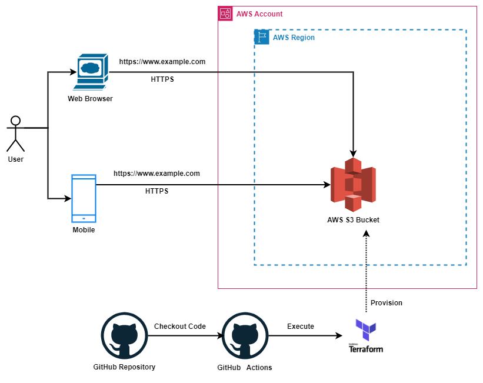

# Serverless Frontend

This project is a working prototype for a serverless webassembly frontend developed as a single-page application (SPA) ui using Blazor WebAssembly on AWS S3 provisioned by Terraform.

### Microsoft Blazor Web Framework

Blazor is a free and open-source web framework that enables developers to create web apps using C# and HTML.

Six different editions of Blazor apps have been announced.

**Blazor Server:** These apps are hosted on an ASP.NET Core server in ASP.NET Razor format. Remote clients act as thin clients, meaning that the bulk of the processing load is on the server. The client's web browser downloads a small page and updates its UI over a SignalR connection. Blazor Server was released as a part of .NET Core 3.

**Blazor WebAssembly:** Single-page apps that are downloaded to the client's web browser before running. The size of the download is larger than for Blazor Server, depends on the app, and the processing is entirely done on the client hardware. However, this app type enjoys rapid response time. As its name suggests, this client-side framework is written in WebAssembly, as opposed to JavaScript (while they can be used together).

**Blazor PWA and Blazor Hybrid editions:** The former supports progressive web apps (PWA). The latter is a platform-native framework (as opposed to a web framework) but still renders the user interface using web technologies (e.g. HTML and CSS).

**Blazor Native:** A platform-native framework that renders a platform-native user interface – has also been considered but has not reached the planning stage.

**Blazor United:** These apps will be a combination of both Blazor Server and Blazor WebAssembly and allow a "best of both worlds" solution where developers would be able to more finely tune the rendering mode. This approach would overcome the shortcomings of the potentially large up-front download that Blazor WebAssembly requires and the constantly open SignalR connection that Blazor Server requires. This version of Blazor is currently part of the .NET 8 roadmap and has not yet been released.

Despite the confusion that the descriptions of ASP.NET and Blazor could generate, the latter focuses on the creation of web applications with the aim of using the C# programming language instead of the JavaScript language, which is commonly used in this type of application.

With the release of .NET 5, Blazor has stopped working on Internet Explorer and the legacy version of Microsoft Edge.

### References

* https://dotnet.microsoft.com/en-us/apps/aspnet/web-apps/blazor
* https://learn.microsoft.com/en-us/samples/dotnet/blazor-samples/blazor-samples